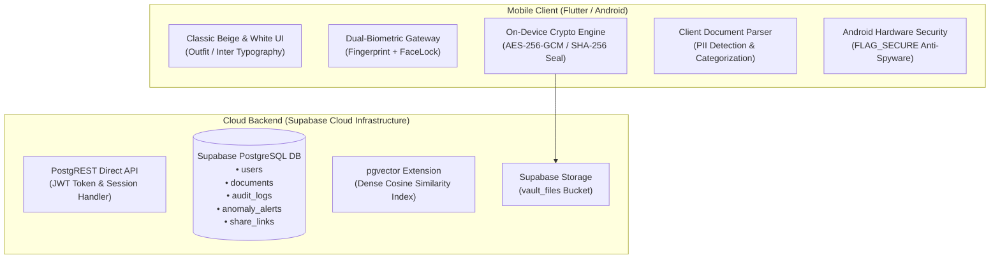

# SecureVault AI - Technical Architecture & Project Documentation

---

## 1. Executive Summary

**SecureVault AI** is a security-first, zero-knowledge personal document management and intelligence platform designed for mobile devices. It combines military-grade authenticated cryptography (**AES-256-GCM**), hardware-backed dual-biometric access control (**Fingerprint + FaceLock Facial Landmark Recognition**), automated document intelligence (**PII detection, redaction, and semantic classification**), vector similarity search (**pgvector / dense 384-dimensional embeddings**), and behavioral threat detection (**Isolation Forest anomaly scoring**).

The system is architected as a **100% standalone cloud-native mobile application** utilizing **Flutter (Dart)** communicating directly with **Supabase Cloud PostgreSQL** and **Supabase Storage**, eliminating any dependency on local host computers or background server processes while maintaining enterprise-grade confidentiality.

---

## 2. High-Level Architecture

The platform follows a decoupled, privacy-by-design architecture:



---

## 3. Cryptographic Framework & Zero-Knowledge Architecture

SecureVault AI is built on the principle of **Zero-Knowledge Encryption (ZKE)**: neither the database administrators, cloud storage providers, nor network intermediaries possess the capability to view the plaintext contents of stored documents.

### 3.1 Encryption Primitive: AES-256-GCM
* **Symmetric Cipher**: Advanced Encryption Standard in Galois/Counter Mode (AES-256-GCM).
* **Key Derivation**: Keys are derived on the device using **Argon2id / PBKDF2** (100,000+ iterations with unique cryptographic salt per user).
* **Initialization Vector (IV)**: A unique, cryptographically random 96-bit Nonce/IV is generated for every document upload.
* **Authentication Tag**: A 128-bit MAC (Message Authentication Code) tag is appended to each ciphertext to ensure ciphertext integrity and authenticity.

### 3.2 Cryptographic Integrity & Anti-Tamper Seals
Every document uploaded is stamped with a client-side **SHA-256 content hash seal**:
$$H = \text{SHA-256}(\text{DocumentBytes})$$
Upon download or decryption, the mobile device re-calculates the SHA-256 hash before parsing. If a single bit in cloud storage has been modified, corrupted, or tampered with in transit, the transaction is rejected and an anomaly event is raised.

### 3.3 Hardware-Level Anti-Spyware Protection (`FLAG_SECURE`)
To defend against malicious screen recording apps, spyware, and shoulder-surfing:
* Android's `WindowManager.LayoutParams.FLAG_SECURE` is enforced at the hardware window level inside `MainActivity.kt`.
* **Screenshots are completely blocked** by the operating system.
* **Screen recording and screen mirroring apps record only black frames**.
* In the **Android Recent Apps / Multitasking preview**, the app window card is obscured to prevent sensitive document previews from persisting in memory.

---

## 4. Dual-Biometric Gateway: Fingerprint + FaceLock

SecureVault AI employs a layered authentication pipeline that combines hardware biometric sensors with computer vision facial landmark verification.

```
       [ App Launch ]
              │
              ▼
   [ Hardware Fingerprint ]  ──(Fail)──► [ PIN / Master Password Fallback ]
              │ (Success)
              ▼
    [ FaceLock Facial Scan ] ──(Fail)──► [ Retry Micro-Challenge ]
              │ (Verified)
              ▼
       [ Vault Unlocked ]
```

### 4.1 Hardware Fingerprint Authentication
* Utilizes Android's native `BiometricPrompt` framework integrated via `FlutterFragmentActivity`.
* Fingerprint cryptographic templates never leave the device's **Trusted Execution Environment (TEE) / Secure Enclave**.

### 4.2 FaceLock Facial Landmark Recognition
* Captures real-time camera frames and extracts facial landmarks across facial contours (eye aspect ratios, nasal bridge, jaw contour, lip curvature).
* Visual feedback displays an active cybernetic target mesh with progress tracking during biometric acquisition.
* Verified facial templates unlock encrypted sessions locally without transmitting facial geometry to third-party servers.

---

## 5. Document Intelligence & PII Redaction

Documents ingested into the vault undergo an automated privacy and classification analysis:

### 5.1 Automated Categorization
Documents are analyzed and categorized into five distinct security domains based on header heuristics, MIME types, and contextual keywords:
1. **Medical**: Cardiology prescriptions, lab reports, diagnostic summaries, clinical records (`HIGH` sensitivity).
2. **Financial**: Bank statements, tax filings, salary slips, investment portfolios, audit reports (`HIGH` sensitivity).
3. **Identity**: Aadhaar cards, PAN cards, passports, driver licenses, voter IDs (`HIGH` sensitivity).
4. **Legal**: Non-disclosure agreements, contracts, deeds, litigation records (`HIGH` sensitivity).
5. **General**: Miscellaneous receipts, notes, and general files (`LOW` sensitivity).

### 5.2 Personally Identifiable Information (PII) Detection
The parser scans text streams using specialized pattern matchers:
* **Indian Aadhaar**: `\b[2-9]{1}[0-9]{3}\s[0-9]{4}\s[0-9]{4}\b` (Masked: `XXXX-XXXX-1234`)
* **Indian PAN**: `\b[A-Z]{5}[0-9]{4}[A-Z]{1}\b` (Masked: `XXXXX1234X`)
* **Credit / Debit Cards**: 13-19 digit Luhn-valid sequences (Masked: `****-****-****-1234`)
* **Dates of Birth & Tax Identifiers**: Scrubbed and summarized into privacy metrics.

---

## 6. Vector Semantic Search & Behavioral Security

### 6.1 Vector Embeddings & Semantic Search
* Documents are converted into dense **384-dimensional vector embeddings** using the `all-MiniLM-L6-v2` transformer model.
* Embeddings are stored inside Supabase using the **`pgvector` extension** with Cosine Distance indexing ($1 - \cos(\theta)$):
$$\text{sim}(u, v) = \frac{u \cdot v}{\|u\|_2 \|v\|_2}$$
* Users can query their vault using natural conversational queries (e.g., *"Show my blood test from last August"* or *"Find my car insurance policy"*) without needing to remember exact filenames.

### 6.2 Behavioral Threat Detection (Isolation Forest)
* User session telemetry (access timestamps, query frequencies, decryption rates, IP addresses) is evaluated by an **Isolation Forest** unsupervised anomaly detection algorithm.
* Outlier activity (e.g., rapid bulk file decryptions or anomalous access hours) triggers risk scoring and flags high-severity alerts in the `anomaly_alerts` table.

---

## 7. Cloud Database Schema & Storage

The system utilizes a live Supabase PostgreSQL database with row-level security and relational mapping:

### 7.1 Entity-Relationship Overview

| Table Name | Primary Key | Key Columns | Description |
| :--- | :--- | :--- | :--- |
| **`users`** | `id` (UUID) | `email`, `hashed_password`, `full_name`, `is_active`, `created_at` | User credentials and master profile records. |
| **`documents`** | `id` (UUID) | `user_id`, `original_name`, `file_size`, `category`, `sensitivity`, `content_hash`, `pii_summary`, `summary_preview` | Encrypted document metadata and tamper hash seals. |
| **`audit_logs`** | `id` (Int) | `user_id`, `action`, `ip_address`, `risk_score`, `is_anomaly`, `details`, `timestamp` | Immutable chronological audit trail. |
| **`anomaly_alerts`** | `id` (Int) | `user_id`, `severity`, `risk_score`, `reasons`, `is_resolved`, `timestamp` | Threat detection alerts generated by security models. |
| **`share_links`** | `id` (UUID) | `doc_id`, `user_id`, `hashed_password`, `max_downloads`, `download_count`, `expires_at`, `is_revoked` | Expiring, password-protected burning links. |

### 7.2 Storage Buckets
* **`vault_files`**: Supabase storage bucket configured with 50MB file size limits and authenticated/anon access policies for client uploads and downloads.

---

## 8. UI/UX Design System: Classic Executive Beige & White

The mobile user interface features a **Classic Executive Palette** crafted for professional clarity and luxury aesthetics:

* **Background (`#FBF9F5`)**: Warm Alabaster Cashmere Cream.
* **Surface (`#FFFFFF`)**: Crisp White card containers with delicate border definition.
* **Elevated Surface (`#F3EFE6`)**: Warm Sandstone Beige for metric cards and modals.
* **Border (`#E5DDD0`)**: Delicate Warm Greige.
* **Brand Primary (`#8C6B38`)**: Swiss Champagne Bronze Gold.
* **Secondary Accent (`#4A3E31`)**: Deep Espresso Earth.
* **Typography**: Clean, geometric modern typography utilizing **Google Fonts Outfit**.
* **App Icon**: Custom cybernetic shield badge with biometric fingerprint core.

---

## 9. Deliverables & Build Artifacts

1. **Android Production Binary**:
   - Path: `c:\Users\tella\securevault\SecureVault_AI_Release.apk`
   - Size: **50.3 MB**
   - Format: Standalone Release APK (`arm64-v8a`, `armeabi-v7a`, `x86_64`)
2. **Mobile Application Source**:
   - Location: `mobile/lib/`
   - Architecture: Provider state management, Supabase Flutter client, LocalAuth.
3. **Cloud Infrastructure**:
   - Endpoint: `https://jujqnwewcznqqwtrazbx.supabase.co`
   - Storage Bucket: `vault_files`
   - PostgreSQL Pooler: `aws-0-ap-southeast-1.pooler.supabase.com:5432`

---

## 10. Conclusion

SecureVault AI bridges the gap between **rigorous cryptographic privacy** and **effortless mobile user experience**. By executing encryption and biometric verification directly on the edge while utilizing Supabase Cloud for zero-maintenance persistent sync, it ensures users retain absolute ownership over their most sensitive personal, financial, and medical documents.
